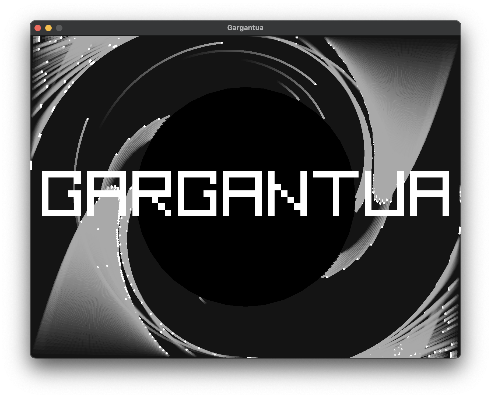
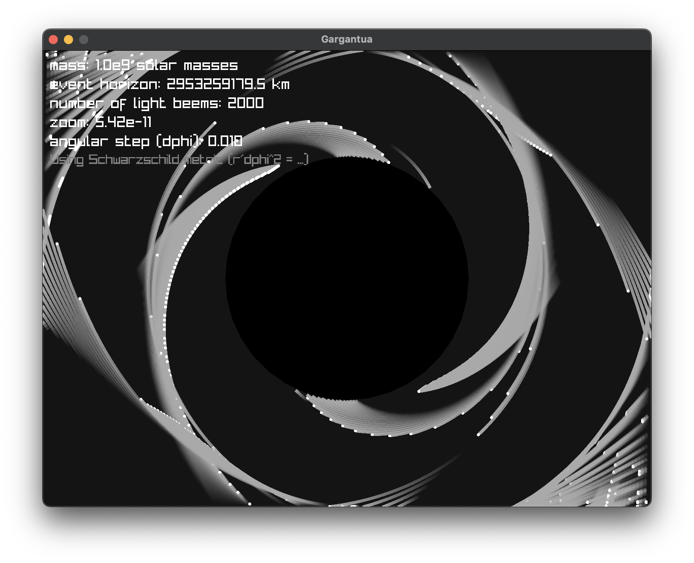

# Gargantua — Black Hole Light Simulation

This project is an interactive simulation of light beams bending around a Schwarzschild black hole, written in **[Rust](https://github.com/rust-lang/rust)** with [raylib](https://www.raylib.com/).

## Inspiration

The simulation is inspired by **Gargantua**, the cinematic black hole depicted in _Interstellar_.

- Like in the movie, the central black hole is modeled with a mass of **10⁸ solar masses**.
- While the film used advanced ray-tracing and input from physicist **Kip Thorne**, this project focuses on a simplified, interactive visualization that captures the **essence of light bending** without requiring movie-level rendering power.

## Physics Background

The simulation models **null geodesics** (paths of light) in the Schwarzschild metric.

We transform radial distance \( r \) into its inverse

\[
u = \frac{1}{r}
\]

to simplify calculations, and integrate with respect to angle \( \phi \) instead of time.

The governing geodesic equation is:

\[
\frac{d^2u}{d\phi^2} + u = \frac{3GM}{c^2} u^2
\]

where

- \( G \) — Newtonian constant of gravitation
- \( M \) — black hole mass
- \( c \) — speed of light

Integration is performed using a **4th-order Runge–Kutta (RK4)** method for numerical stability and smoothness.

### Event Horizon Radius

The Schwarzschild radius, representing the event horizon, is calculated as:

\[
r_s = \frac{2GM}{c^2}
\]

## Visual & Technical Liberties

To balance performance, clarity, and cinematic style, several liberties were taken:

- **Mass & scale**: The black hole’s mass matches _Interstellar_’s Gargantua, but distances are dynamically scaled to fit the screen.
- **Angular stepping**: Instead of evolving in physical time, beams advance in fixed angular increments

\[
\Delta \phi
\]

making the simulation smoother and easier to control interactively.

- **Beam initialization**: Beams are spawned uniformly from screen edges, rather than from astrophysical sources.
- **Trail fading**: Each light beam leaves behind a fading trail to emphasize deflection visually.
- **Respawn logic**: Beams that cross the event horizon or leave the viewport are reset to keep the simulation full.
- **Overlay modes**: Press **I** to toggle between cinematic title mode (_GARGANTUA_) and physics information mode.

### Examples

## Controls

- **Z / X** — Zoom in / out
- **I** — Toggle title/info overlay

## Requirements

- [Rust](https://github.com/rust-lang/rust)
- [raylib-rs](https://github.com/deltaphc/raylib-rs)

## Future Developments

This simulation currently focuses on Schwarzschild (non-spinning) black holes and 2D light bending. Planned improvements include:

- **Black hole spin** — Upgrade to Kerr metric for rotating black holes.
- **Accretion disks** — Add luminous accretion disks with lensing.
- **Gravitational redshift** — Show photon energy shifts near the horizon.
- **3D rendering** — Extend into full 3D ray-tracing for immersive visuals.
